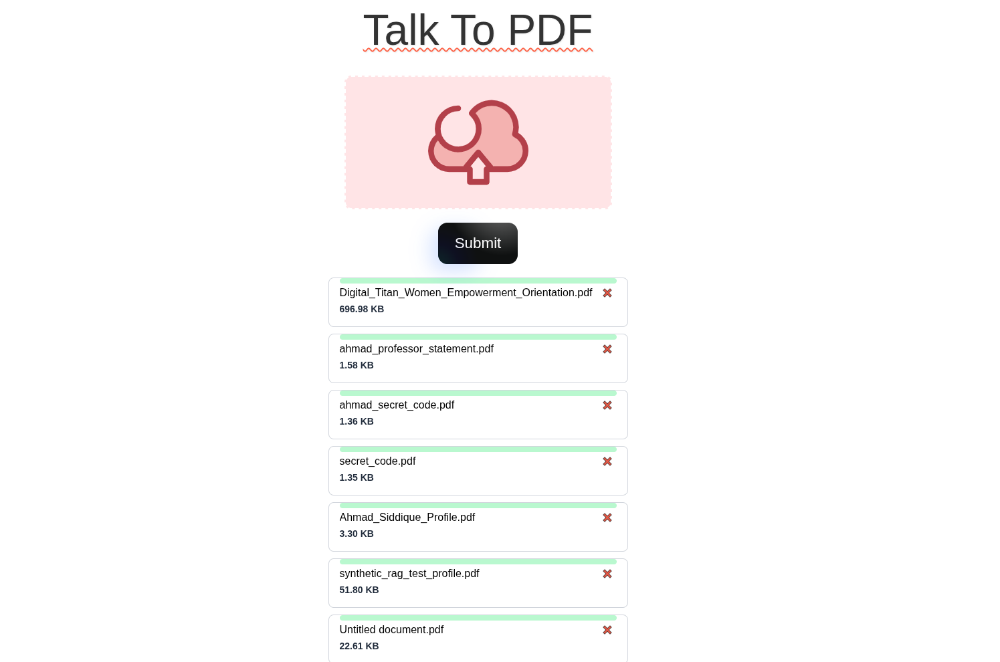
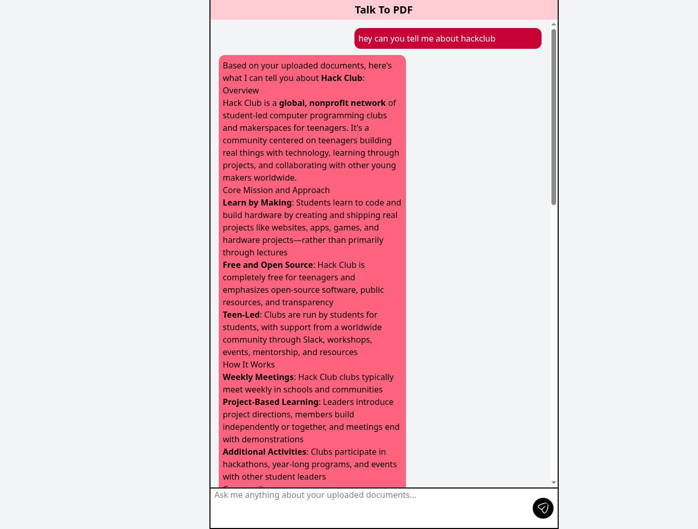
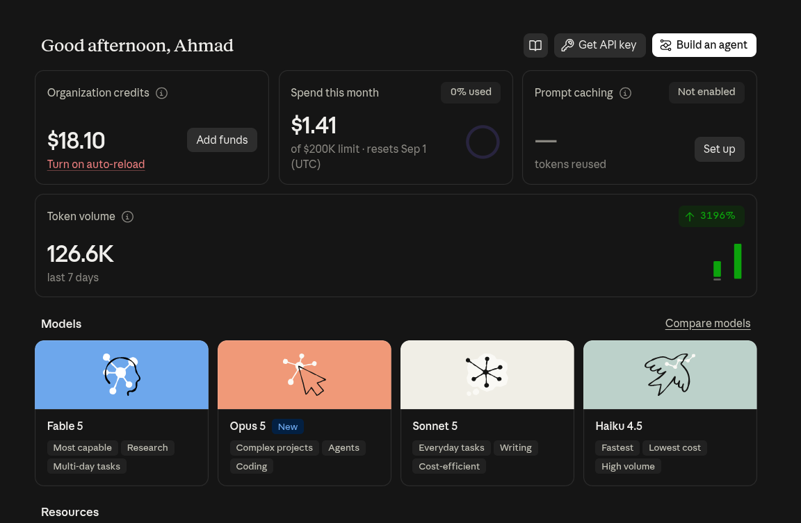

# Talk To PDf 

Talk to pdf is a project which enables you to upload pdf's you can chat and ask questions regarding this pdf

Now not like traditional you can upload tons of pdf just keeping in mind these pionts

- If (pdf.page > 20) {
    upload just two pdf
}

- else if (pdf.page === 10 | pdf.page < 10 ) {
    you can upload upto five
}

- else if (pdf.hasImages) { Then we are not having Image processing so you don't expect result for image but text will be embedded}

- else {
    if (uploaded.count > limit) {
        WE will have to wait for a day cause we will hit limit of RPD | RPM
    }
    else {
        Enjoye and talk to your PDF and upload upto 30 even but one by one if larger and upload textual content Please!
    }
}   

## Upload Page


## Chat page



## Note
> Talk To PDF is an Open Source Project Just use it if you need don't use for Fun because we pay for token and I've reserved just 20$.



## How to Use

- go to 
```
https://talktopdf.ahmadsiddique.dev/chat
``` 
- Upload documents
- Click on Chat button 
- And start chatting

## How to Contribute
> Git and Docker must be installed on your laptop or Computer

- Clone (git not some human dumb! just copy command below)
```bash
git clone https://github.com/ahmadsiddique-dev/talk-to-pdf
```
- Change Diretory
```bash
cd talk-to-pdf
```

- Make __.env__ file and paste
```bash
MONGODB_ATLAS_URI=you_mongodb_atlas_url
MONGODB_ATLAS_DB_NAME=talk-to-pdf
MONGODB_ATLAS_COLLECTION_NAME=pdfs
export GOOGLE_API_KEY=your_google_ai_api_key
export ANTHROPIC_API_KEY=your_anthropic_api_key
```

- Run Container
```bash
docker compose up -d --build
```

- See the logs 
```bash
docker compose logs -f
```

# Happy Coding 
and take care